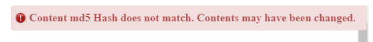

```{r setup, include=FALSE}
knitr::opts_chunk$set(echo = TRUE)
```

## hashchecking

This is an R Markdown html document. However, what is special about this document is that we can be sure that the contents are unaltered. 

You may ask "how" - and the answer is through hashing. We have calculated the hash of the file that was intended to be shared. by comparing the calculated hash against the hash of the webpage, we can be confident that the contents are not manipulated.

When the contents are the same, the following notification will appear!


However, if the contents are changed in any way, the following notification is provided:



## Feedback

This idea is very much a work in progress, so I would definitely love any feedback or ideas! Goal is to support cases where we want to be confident and certify an html page that the contents are not changing!